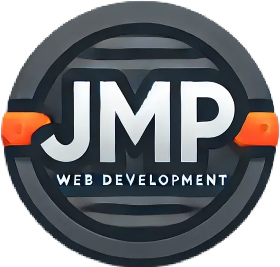

# MI PORTAFOLIO

**Bienvenido a mi portfolio!**

Este sitio que he creado con mucho cariño, he intentado hacerlo de la manera más aprovechable posible para ser reutilizado.

## Índice / FAQ

- [¿Como que puedo reutilizarlo?](#hazlo-tuyo)
- [¿Qué tecnologías se usan en la app?](#tecnologías)
- [¿Ha sido todo ideado por tí mismo?](#créditos)
- [Me has caído genial, ¿como puedo ayudarte?](#feedback)

### Hazlo tuyo

En el archivo `.envexample` he preparado una plantilla de las variables de entorno que he configurado para que puedas hacer algunos cambios.

- `VITE_LOGO` es el logo de tu marca
- `VITE_MODEL_IMAGE`es la imagen central que va dentro de las tarjetas
- `VITE_EMAILJS_SERVICE_ID`, `VITE_EMAILJS_TEMPLATE_ID` y `VITE_EMAILJS_PUBLIC_API_KEY` son las variables para configurar el formulario de contacto que trabaja con `emailJS`.
- `VITE_RECAPTCHA_SITE_KEY` es la key que sacamos del ReCaptcha de Google

### Tecnologías

Este portfolio en landing page usa las siguientes tecnologías:

- HTML5
- Tailwind (CSS3)
- React + Vite

### Créditos

La mayor parte de lo desarrollado en esta landing ha sido ideado por mi, a excepción de la animación 3D, que es una versión adaptada (y bastante modificada) de @LunDev

### Feedback

**¿Has visto algún error o quieres aconsejarme?**

Escríbeme a `juanmaciasperez89@gmail.com`

**¿Quieres ayudarme de alguna forma?**

Dale una estrella al proyecto, o usa el correo de contacto pero en PayPal jajaja
